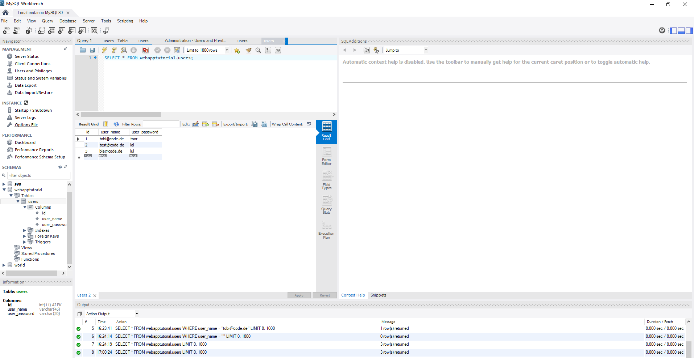
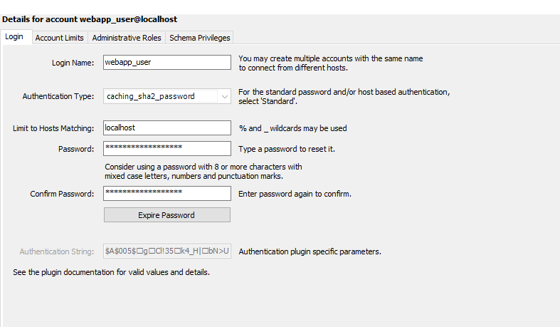

# JavaEE_webapp

## Explanation of the project
This is a simple webapplication on a Tomcat Server with Java Servlets, Java Server Pages (JSP) and a MySql Database.  

This code is for a revision of simple Java EE concepts according to the tutorial of Jon Bertelsen. 
(https://www.youtube.com/channel/UCyQXWm-Y8X4887c604FTPsA/videos)

##Security Outlook & Improovements to this project

If you want to deploy the web-server, then you would need to create the WAR file and upload it to a webserver.  
You would also need to make:  
- the Code SQL-Injection safe  
- use Encryption for sensible data  
- build a RDB -> change the DB_Url in DB_User.java  
- remoove the hardcoded DB-username and DB-userpassword -> work with Environment Variables on your web server  
You can then get the Environmentvariables, which should be your DB-URL, DB-username and DB_userpassword with System.getProperty(#environmentVariableName). Example Environment Variables:  
---DJDBC_CONNECTION_STRING=jdbc:mysql://#host_name.#domain_name.com:3306/#schema_name  
---DJDBC_USER=root  
---DJDBC_PASSWORD=test_pw  
- migrate your local MySql Schema to a RDB-System -> MySql Workbench provides a migration wizard therefore  

## Some Pictures of the example project

<ul>
  MySQL-Database
  <li>   </li>
  <li>   </li>
</ul>

